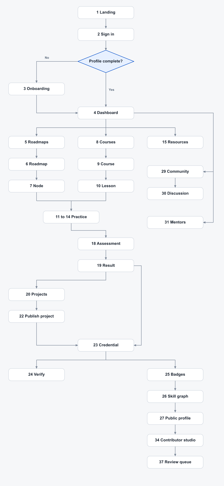

# Developer guide: screens and build order

Build the product UI in the order below. Each screen depends on the ones before it. The sequence follows the learning loop in [`AGENTS.md`](../AGENTS.md):

**Discover → Learn → Practice → Build → Prove → Share → Grow**

Landing (`/`) and sign-in (`/login`) already exist. `/dashboard` is a signed-in shell. Everything after onboarding fills that shell.

Sign-in uses a Coddle account. Learn verifies the Coddle session, upserts a local user (`coddle_user_id`), syncs name, email, and avatar, and sets a Learn session cookie. Logout clears the Learn session only. Password reset and Google/GitHub stay on Coddle.

## How a person moves through the app



First visit after sign-in goes to **onboarding**. Every later visit goes to the **dashboard**. The dashboard is the home: continue learning, roadmap progress, daily goal, projects, credentials, and community activity. Catalogs, search, notifications, and settings are reached from it.

## Already built

| Screen | Route | State |
|---|---|---|
| Landing | `/` | Built |
| Sign in | `/login` | Built |
| Dashboard | `/dashboard` | Shell only. Replace it when screen 4 is in progress. |

## Build order

### Arrive

**1. Landing** — `/`  
What Coddle Learn is, the learning loop, and featured roadmaps, courses, and resources. Primary action is sign-in. Built.

**2. Sign in** — `/login`  
Continue with Coddle. On desktop the page is two columns: a photograph on the left, the form on the right. Errors stay on this page (`signin_failed`). Success creates the Learn session and sends a new user to onboarding, or a returning user to the dashboard. Built.

**3. Onboarding** — `/onboarding`  
Shown once, until the learner finishes setup. Steps:

1. Profile. Confirm the synced Coddle identity (name, email, avatar), write a short bio, and choose a level: beginner, intermediate, or advanced.
2. Add skills from the catalog, or type your own.
3. Pick one roadmap to start. The best match for the level and skills is marked and selected.
4. Set a daily learning goal.
5. Review the choices and start.

Finishing marks onboarding complete and opens the dashboard. Later visits skip this screen. Skills, bio, and the goal can be changed from the profile editor and settings.

**4. Dashboard** — `/dashboard`  
Signed-in home. Build the shell first, then fill each block as its screen exists:

- Continue learning (next roadmap node, next lesson)
- Active roadmap and completion percentage
- Daily goal progress
- Courses in progress
- Saved resources
- Projects
- Credentials and badges
- Recent community activity
- Unread notifications

Empty states point at roadmaps, courses, and resources. Sign out returns to the landing page.

### Roadmaps

**5. Roadmap catalog** — `/roadmaps`  
Paths to choose from, with difficulty, step count, and progress if enrolled. This is the main way into the product.

**6. Roadmap** — `/roadmaps/[slug]`  
Ordered steps on a vertical timeline, completion percentage, and an in-page step panel. Actions: start, select a step, mark complete or skip. Optional deep-link `?step=slug` stays on this page (no separate step routes).

**7. Roadmap step (in-page)** — same URL as the roadmap  
Selecting a step opens the detail panel: summary, estimated time, curated external resources, Complete, and Skip. Completing or skipping updates progress on the roadmap and the dashboard.

### Courses

**8. Course catalog** — `/courses`  
Contributor courses, filterable by technology and difficulty. Only published courses appear.

**9. Course** — `/courses/[slug]`  
Modules, lessons, progress, and the final assessment.

```
Course
 ├── Module
 │    ├── Lesson
 │    ├── Resource
 │    ├── Quiz
 │    └── Exercise
 ├── Module
 └── Final Assessment
```

Enrolling starts progress. Completing every required lesson and the final assessment marks the course complete.

**10. Lesson** — `/courses/[slug]/lessons/[lessonSlug]`  
Text, code examples, video links, and external resources. Mark complete to advance the course and any roadmap node this lesson belongs to.

### Practice

These four screens are the interactive layer on a lesson or roadmap node. A browser IDE and automated grading come later. For now, challenges are specified and submitted as text or a repo link.

**11. Quiz** — `/quizzes/[id]`  
Knowledge check: multiple choice, true/false, and fill-in-the-blank. Score is immediate. This is practice, not a credential.

**12. Flashcards** — `/flashcards/[id]`  
Prompt and answer cards for a lesson or node. Completion counts toward the daily goal.

**13. Exercise** — `/exercises/[id]`  
A short interactive task inside a module (follow a prompt, produce an answer, mark it done).

**14. Coding challenge** — `/challenges/[slug]`  
A coding problem with a prompt, starter notes, and a submission. Passing can feed a project assessment or a badge.

### Resources

**15. Resource catalog** — `/resources`  
External resources from docs, GitHub, YouTube, MDN, freeCodeCamp, universities, and blogs. Filters: type, difficulty, technology. Only published resources appear.

**16. Resource** — `/resources/[slug]`  
Title, description, URL, type, difficulty, technologies, contributor, and verification status. Actions: open the link, bookmark, report (broken link, outdated, incorrect, or poor quality).

**17. Saved** — `/saved`  
Bookmarked resources and anything else the learner pinned. The dashboard links here.

### Assessments and proof of work

**18. Assessment** — `/assessments/[id]`  
The real check for a course or roadmap. Question types: multiple choice, true/false, short answer, coding challenge, and project assessment. One sitting, with a passing score.

**19. Result** — `/assessments/[attemptId]`  
Score, pass or fail, and past attempts. A pass can issue a credential. A fail links back to the lessons that cover the missed topics.

**20. Project catalog** — `/projects`  
Practical work from beginner to advanced, tied to a roadmap or course.

**21. Project brief** — `/projects/[slug]`  
Requirements, technologies, and what done means.

**22. Publish project** — `/projects/[slug]/publish`  
The showcase entry: name, description, screenshots, GitHub repo, live URL, technologies, related roadmap or course, challenges faced, and what they learned. Publishing attaches it to the public profile.

### Credentials, badges, and skills

**23. Credential** — `/credentials/[id]`  
Issued for a passed assessment, a published project, or a completed skill. Shows the achievement and a public verification URL. Credentials are free.

**24. Verify credential** — `/verify/[code]`  
Public. No sign-in. Confirms the credential and what it was issued for.

**25. Badges** — `/badges`  
Smaller achievements: first course, first project, streak, open-source contributor, roadmap completed, mentor, course creator, resource reviewer. Earned badges also show on the public profile and the dashboard.

**26. Skill graph** — `/skills`  
Skill relationships built from completed learning, assessments, projects, and credentials (for example JavaScript → TypeScript → React → Next.js → Frontend Engineering). A finished course alone does not add the skill. The graph also appears as a section on the public profile.

### Profile and community

**27. Public profile** — `/u/[username]`  
The shareable learning profile: bio, skills, skill graph, roadmaps and progress, projects, credentials, badges, contributions, and community activity. Follow and unfollow live on this page.

**28. Profile editor** — `/profile`  
Edit bio, skills, and which activity is public. Distinct from onboarding: onboarding runs once, this screen is the ongoing editor.

**29. Community** — `/community`  
Questions and discussions about courses, roadmaps, and projects. Ask a question or share a project.

**30. Discussion** — `/community/[id]`  
One thread: the question, answers, comments, and likes.

### Mentorship

The mentor marketplace, payments, and premium sessions stay out of this pass. These three screens are the free request flow.

**31. Mentor directory** — `/mentors`  
Mentors by technology and topic. Search includes mentors.

**32. Mentor profile** — `/mentors/[username]`  
Expertise, technologies, experience, availability, and topics they will help with.

**33. Mentorship request** — `/mentors/[username]/request`  
Request code review, career guidance, project feedback, technical guidance, or learning advice. The mentor sees it in notifications. A completed session can award the mentor badge.

### Contribute

**34. Contributor studio** — `/contribute`  
Submit a course, lesson, roadmap, resource, project, challenge, or tutorial. Each submission has a status: pending, under review, approved, published (or rejected). The author can see status and reviewer notes here.

**35. Contributor profile** — `/u/[username]/contributions`  
Impact: content published, reviews done, and code contributions. Linked from the public profile.

### Moderation

Restricted to admins.

**36. Admin home** — `/admin`  
Queues that need a decision: pending submissions, open reports, and people flagged for suspension.

**37. Review queue** — `/admin/review`  
Move a submission through pending → under review → approved → published, or reject it. Publishing is what makes it show up in the catalogs.

**38. Reports** — `/admin/reports`  
Community reports: broken link, outdated, incorrect, poor quality. Actions: remove the content, or mark a resource outdated.

**39. People** — `/admin/users`  
Look up a user and suspend a contributor.

### Find, return, and account

**40. Search** — `/search`  
One search across courses, roadmaps, resources, projects, developers, mentors, and technologies. Build this after those catalogs exist.

**41. Notifications** — `/notifications`  
Course and roadmap updates, replies, mentor requests, project feedback, achievements, and recommendations. A count on the dashboard header is enough to start.

**42. Settings** — `/settings`  
Notification preferences, profile visibility, and sign out. Sign out clears the Learn session and returns to the landing page.

## Feature coverage

Every product area in `AGENTS.md` maps to a screen in this pass, or to a later pass called out here.

| Feature in AGENTS.md | Where it lives |
|---|---|
| Authentication (Coddle SSO, session, logout) | 2 Sign in, 42 Settings |
| User profile | 3 Onboarding, 28 Profile editor, 27 Public profile |
| Roadmaps (nodes, prerequisites, start, complete, skip, progress) | 5–7 |
| Courses (modules, lessons, video, code, progress, completion) | 8–10 |
| External resources | 15–17 |
| Resource verification | 16 Resource status, 34 Studio, 37 Review queue |
| Community reports | 16 Report action, 38 Reports |
| Quizzes, MCQ, true/false, fill-in-the-blank, knowledge checks | 11 Quiz |
| Flashcards | 12 Flashcards |
| Exercises | 13 Exercise |
| Coding challenges | 14 Coding challenge, 18 Assessment |
| Projects and showcase | 20–22 |
| Assessments | 18 Assessment, 19 Result |
| Credentials and public verification | 23 Credential, 24 Verify |
| Badges (including streak, mentor, creator, reviewer) | 25 Badges |
| Community (ask, answer, comment, like, follow) | 29 Community, 30 Discussion, 27 Follow on profile |
| Bookmarking | 16 Resource, 17 Saved |
| Mentorship (profile, expertise, availability, requests) | 31–33 |
| Contributor submissions and status | 34 Contributor studio |
| Contributor impact | 35 Contributor profile |
| Admin review, reject, remove, suspend, mark outdated | 36–39 |
| Search | 40 Search |
| Notifications | 41 Notifications, count on 4 Dashboard |
| Dashboard (continue, progress, daily goal, projects, credentials, community) | 4 Dashboard |
| Skill graph | 26 Skill graph, section on 27 Public profile |

## Later, on purpose

These are in the product plan and have no screen in this build. Add them after the loop above works.

| Feature | Why it waits |
|---|---|
| Passkeys, GitHub identity verification | After Coddle SSO is solid |
| Browser coding environment, automated evaluation | Challenges are submitted without an in-browser IDE |
| AI learning assistant | Explains, quizzes, and recommends. It does not replace the content screens |
| Premium: AI, advanced assessments, premium courses, paid mentor sessions, analytics, private environments, org dashboards, managed hosting, enterprise | Core learning stays free |
| Employer marketplace, payments, mobile app | Outside the first learning loop |

## Suggested route files

Under `apps/web/src/app/`:

```
page.tsx
login/page.tsx
onboarding/page.tsx
dashboard/page.tsx
roadmaps/page.tsx
roadmaps/[slug]/page.tsx
courses/page.tsx
courses/[slug]/page.tsx
courses/[slug]/lessons/[lessonSlug]/page.tsx
quizzes/[id]/page.tsx
flashcards/[id]/page.tsx
exercises/[id]/page.tsx
challenges/[slug]/page.tsx
resources/page.tsx
resources/[slug]/page.tsx
saved/page.tsx
assessments/[id]/page.tsx
assessments/[attemptId]/page.tsx
projects/page.tsx
projects/[slug]/page.tsx
projects/[slug]/publish/page.tsx
credentials/[id]/page.tsx
verify/[code]/page.tsx
badges/page.tsx
skills/page.tsx
u/[username]/page.tsx
u/[username]/contributions/page.tsx
profile/page.tsx
community/page.tsx
community/[id]/page.tsx
mentors/page.tsx
mentors/[username]/page.tsx
mentors/[username]/request/page.tsx
contribute/page.tsx
admin/page.tsx
admin/review/page.tsx
admin/reports/page.tsx
admin/users/page.tsx
search/page.tsx
notifications/page.tsx
settings/page.tsx
```

Build 3 and 4 next: onboarding, then the real dashboard.
